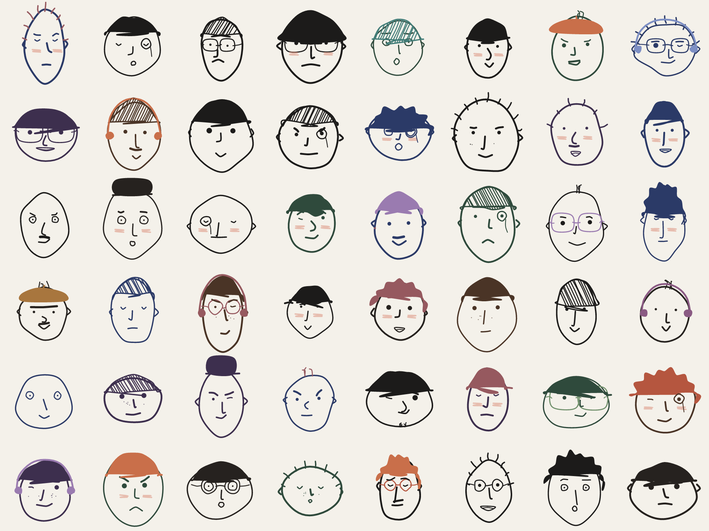
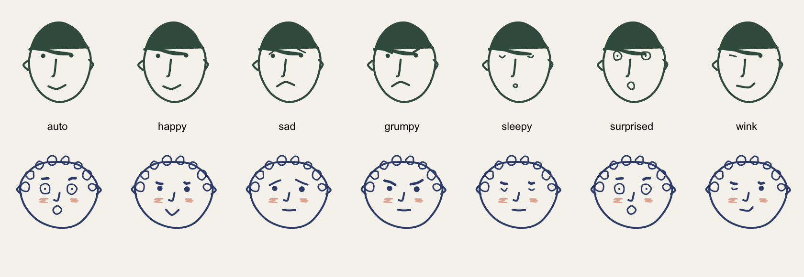
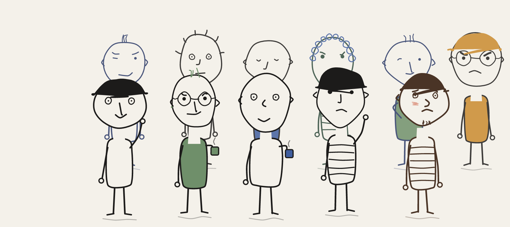

# mugshot

Deterministic hand-drawn doodle face avatars. Hash any string into a charming ink-sketched face.

**Try it: [anaygarodia.github.io/mugshot](https://anaygarodia.github.io/mugshot/)**



Zero dependencies. Pure SVG. Same string, same face, forever.

## Use

```
npm install mugshot-avatars
```

```js
import { face } from "mugshot-avatars";

const svg = face("ada@example.com");          // -> "<svg ...>...</svg>"
const big = face("ada@example.com", { size: 240, background: "#f4f1ea" });
```

Faces come in muted colored inks with occasional colored caps, headphones and blush.
Pass `color: false` (or a fixed `ink`) for classic black.

### Moods

The same seed keeps its identity — head, hair, nose — but you can change its mood:



```js
face(user.id, { mood: "grumpy" });   // build failing
face(user.id, { mood: "happy" });    // build green again
```

`mood: "auto" | "happy" | "sad" | "grumpy" | "sleepy" | "surprised" | "wink" | "calm"` —
`auto` (default) picks a resting expression from the seed. Avatars that react to
state: CI status, error pages, empty inboxes, loading screens.

Drop it anywhere SVG goes:

```js
el.innerHTML = face(user.id);
// or as an :
img.src = "data:image/svg+xml;utf8," + encodeURIComponent(face(user.id));
```

## Alive

`face()` gives you a static SVG. `<mug-shot>` gives you a character:

```html
<script type="module">import "mugshot-avatars/element"</script>

<mug-shot seed="ada@example.com" size="160"></mug-shot>
```

It's not an image, it's a character:

- **line boil** — strokes shimmer like hand-drawn cartoon animation
- **it looks at things** — follows your cursor, watches the input the user is
  typing in, glances around when bored
- **it blinks**, and falls asleep with floating Zzz when idle
  (`idle` attribute, ms, `0` to disable)
- **temperament** — derived from the seed: jumpy ones startle at fast cursors
  and double-blink, social ones smile when hovered, dreamy ones daydream more.
  Two seeds don't just look different, they behave differently.
- **they know each other** — multiple `<mug-shot>`s on one page glance at each
  other, and when one talks the rest turn to look
- **it talks**:

```js
const mug = document.querySelector("mug-shot");
mug.say("hi! I'm your build bot");
mug.react("grumpy");   // build failed
mug.react("happy");    // build green
```

Attributes: `seed`, `mood`, `size`, `color`, `ink`, `idle`. All reactive.
Respects `prefers-reduced-motion`.

## Names draw themselves

Seeds that look like names pick a matching presentation — `face("ada")` gets a
bob, lashes, maybe a flower; `face("alan")` gets a flat cap. Not a name? The
seed decides. Override anytime with `style: "fem" | "masc"`.

## Your GitHub pfp — two steps

1. Go to **[anaygarodia.github.io/mugshot](https://anaygarodia.github.io/mugshot/)**, type your name, click *download 512px PNG*
2. Upload it at [github.com/settings/profile](https://github.com/settings/profile)

Portrait mode (shoulders + soft backdrop) is on by default for downloads.
From a terminal instead: `npx mugshot-avatars yourname` writes `yourname.png`.
From code: `await facePng("yourname")` (browser) returns a PNG data URL, or
`face("yourname", { bust: true, backdrop: true })` for the portrait SVG.

## Crowds

Whole-body doodle people, standing together:



```js
import { crowd } from "mugshot-avatars/crowd";

document.getElementById("team").innerHTML =
  crowd(["ada", "grace", "alan", "edsger", "barbara"]);
```

Each person keeps the exact face their seed has as an avatar — your team page
and your commit avatars are the same people. Poses, sweaters, stripes, coffee
cups all come from the seed.

## Why

Identicons are ugly. Faces are not. Every seed gets a face with its own head shape,
hair (solid, hatched, curls, spikes, bald...), eyes, nose, brows, glasses, mustache —
drawn with a wobbly ink line so it reads as doodled, not generated.

## API

`face(seed: string, options?)` → SVG string

| option | default | |
|---|---|---|
| `size` | `120` | width/height in px |
| `mood` | `"auto"` | expression override, identity unchanged |
| `color` | `true` | muted color palette; `false` = black ink |
| `ink` | — | force one stroke color (implies `color: false`) |
| `background` | `"transparent"` | any CSS color |

Determinism note: a given seed is stable within a major version. Grammar improvements
that change faces only ship as majors.

## Demo

```
npm run build && npx serve .
```
then open http://localhost:3000/demo.html — type your name, click the grid to reroll.
(A plain file:// open won't work; browsers block module imports from disk.)

MIT
